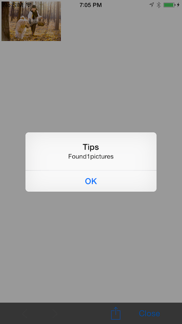

# DCWebView

DCWebView is a iOS Web view component to encapsolute UIWebView on iOS 7 and earlier versions, and WKWebView on iOS 8.x.

The component use the bridge design pattern to hide the differences between UIWebView and WKWebView. Users can just use a group of interfaces provided by DCWebView to do a HTTP navigation, without paying any attentions on the differences.

DCWebView provides not only HTTP navigation and other assistant functions, but also some functions for customizing Web View UI。

Including push style, present style; and whether there is only a navigation bar, a status bar or both, etc.

------

DCWebView 是一个 WebView 组件，它对在 iOS 7.x 及其以前的版本上的 UIWebView，和 iOS 8.x 上的 WKWebView 做了良好的封装。

这个组件使用桥接设计模式隐藏了 UIWebView 和 WKWebView 之间的差异。用户只需使用 DCWebVie 提供的一系列接口来完成 HTTP 的导航以及相关的功能，而无需关注底层的这些不同之处。

DCWebView 不仅提供 HTTP 导航以及相关的辅助函数，也提供定制 Web View 界面的函数。

包括 push 方式弹出、present 方式弹出，以及是否有导航栏、状态栏，或者两者都有。

------

For example,

- Demo


- Pushing WebView with navigation bar and status bar


- Presenting WebView with status bar only


- Presenting WebView with fullscreen


- Presenting WebView and run a java script




------
Usage:

使用方法：

```

- (void)handleMode8ButtonTapped:(id)sender
{
    DCWebViewController *viewController = DC_SAFE_ARC_AUTORELEASE([[ DCWebViewController alloc] initWithURL:[NSURL URLWithString:@"http://www.apple.com"] statusBarHidden:YES navigationBarHidden:YES autorotate:NO]);
    [self presentViewController:viewController animated:YES completion:^{
        
    }];
}

```

```

- (void)handleMode9ButtonTapped:(id)sender
{
    NSString *js = @"var count = document.images.length;for (var i = 0; i < count; i++) {var image = document.images[i];image.style.width=320;};window.alert('Found' + count + 'pictures');";
    
    DCWebViewController *viewController = DC_SAFE_ARC_AUTORELEASE([[ DCWebViewController alloc] initWithURL:[NSURL URLWithString:@"http://www.apple.com"] javaScriptString:js statusBarHidden:NO navigationBarHidden:NO autorotate:NO]);
    [self presentViewController:viewController animated:YES completion:^{
        
        [viewController.webView loadHTMLString:@"<head></head>" baseURL:nil];
        
    }];
}

```

More example for how to use DCWebView, please check the demo project.
